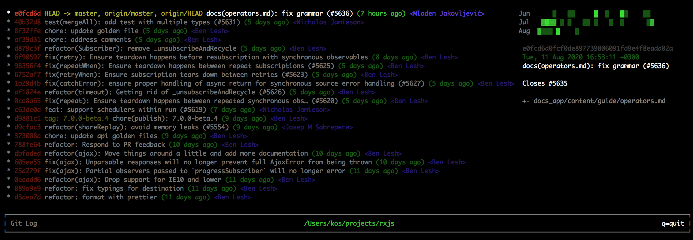

<div align="center">
  <h1>
    <br/>
    Pretty Git Log
    <br/>
    <sub><sub>for day-to-day development</sub></sub>
    <br/>
    <br/>
  </h1>
</div>

## 📟 About

This is a npm package to beautify `git log`



## 🛸 Try it

Clone this repo

```bash
cd git
npm install
./cli.js

# UP DOWN = navigate
# q = quit
```

## 👑 Status

You're welcome to participate in this project!

Please, create an issue if you have ideas how to improve it!

It is built with JS (React + Ink), so it's quite easy to add and update features!

## 💐 Have a good day 🙂

